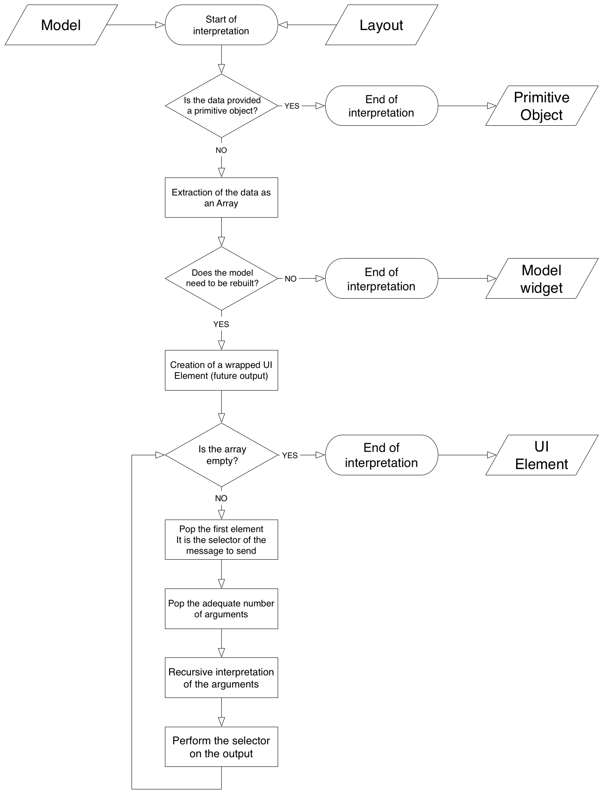

##1\.  The Spec interpreter

In order to create a framework specific UI element a 
*Spec* model is interpreted via the 
**SpecInterpreter**\.
The interpreter is in charge of recursively interpreting all the sub widgets of a model\.
It then combines them, according to the given layout and the given binding\.

The interpreter entry point is the method 
`SpecInterpreter>>#interpretASpec:selector:`\.

This section will explain the two main parts of the interpretation of a model: data collection and the interpretation loop\.
In addition, the flow diagram 
[1\.1](#fig_flow_diagram) outlines the different steps of the process and their relationships\.

###1\.1\.  Collect the data

Before the interpretation loop itself, the interpreter starts by collecting the required data from the model\.
The first element is the array to interpret\.
The second is the spec wrapper used to encapsulate data during the interpretation\.

The array to interpret is extracted from the layout provided by the model\.
The code 
[1\.1](#ex_extract_array) shows the conversion of a SpecLayout into an array of literals that the interpreter can iterate over\.

**Conversion of a SpecLayout into an Array of literals**

    SpecLayout composed
    	newRow: [ :row | row add: #theList ];
    	asArray
    	 
    "returns"	 
    
    #(#ContainerModel 
    	#add: #(
    		#(#ContainerModel 
    			#add: #(
    				#(#model #theList) 
    					#layout: #(
    						#SpecLayoutFrame 
    							#leftFraction: 0 
    							#topFraction: 0 
    							#rightFraction: 1 
    							#bottomFraction: 1 
    							#leftOffset: 0 
    							#topOffset: 0 
    							#rightOffset: 0 
    							#bottomOffset: 0
    					)
    			)
    		) #layout: #(
    			#SpecLayoutFrame 
    				#leftFraction: 0 
    				#topFraction: 0 
    				#rightFraction: 1 
    				#bottomFraction: 1 
    				#leftOffset: 0 
    				#topOffset: 0 
    				#rightOffset: 0 
    				#bottomOffset: 0
    		)
    	)
    )

During the recursive calls of the interpretation loop, the interpreter can be called with any kind of object\.
So the first step is the extraction of the data to interpret, if any\.
If there is no data to interpret, it means that the recursive calls reached a ''primitive object" \(like the integer in the example \*ex\_extract\_array\*\), i\.e\. an object which can not be interpreted\.
In this case the primitive object is directly returned\.

The second item to collect, if the first step succeeded, is the spec wrapper that will be used throughout the interpretation\.
This step checks if the model provided as argument needs to be rebuild or not\.
If not, the currently existing UI element is directly returned\.
Otherwise this step results in the creation of a wrapper object that keeps the current model as well as the receiver of messages that will be performed in the interpretation loop\.
The result of the interpretation is this wrapper object, and the type of the wrapper is determined by the first element of the array\.
For example, the type of the wrapper that results from the interpretation of the example \*ex\_extract\_array\* is determined by the very first ==\#ContainerModel== element\.

\!\!\! Interpretation loop

Once all the required data is collected, the interpretation loop can begin\.

The loop is quite simple\. The first element of the array is popped out of the array to interpret\.
This literal is the selector of the method that will be performed on the receiver that was previously stored inside the wrapper\.
According to the selector, an adequate number of arguments are popped from the array to interpret\.

Each argument is then interpreted using a new ""SpecInterpreter"" instance, following the exact same process\.
This step is the step leading to recursive calls\.

The selector is then performed on the current receiver and given as arguments the results of the argument interpretation\.

The loop ends when the array is empty\.
The resulting adapter is returned and linked to the model that was provided to the interpreter\.
